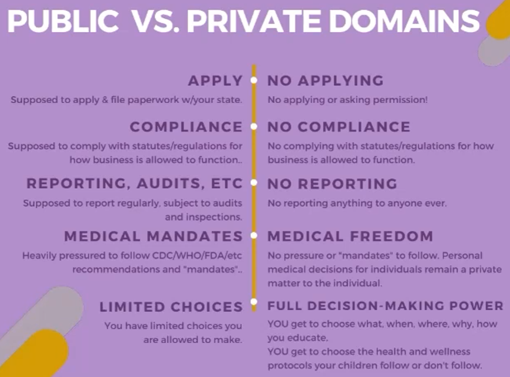

## Understanding the Theory of Connecting Domain Address to Email

1. WE can buy domain name from Godday, Crazy Domain or AWS, which is called DNS provider;

2. Normally, providers provide email server service. We can buy email server depends on your requirements (limited hard drive capacity);

3. Connect your domain name based on smtp.....

4. If u doing so, the email address is much flexible. You can name anything with @domain name. eg. dogshit@dog.com.au

5. Also, u can connect ur domain name with MS 365 email.

5.1 Purchase combo
https://www.microsoft.com/en-au/microsoft-365/business/compare-all-microsoft-365-business-products-b?&ef_id=CjwKCAjwqauVBhBGEiwAXOepkdlT_92CwoiTPqKn1k4mjlrrKV6K3o8Dn7C9aVN6MmOdPMlmQV9LNBoCq8wQAvD_BwE:G:s&OCID=AID2200004_SEM_CjwKCAjwqauVBhBGEiwAXOepkdlT_92CwoiTPqKn1k4mjlrrKV6K3o8Dn7C9aVN6MmOdPMlmQV9LNBoCq8wQAvD_BwE:G:s&lnkd=Google_O365SMB_Brand&gclid=CjwKCAjwqauVBhBGEiwAXOepkdlT_92CwoiTPqKn1k4mjlrrKV6K3o8Dn7C9aVN6MmOdPMlmQV9LNBoCq8wQAvD_BwE
5.2 use one email address to check whether u need a business account (use anyone without organization connection email address. Only use for receive first email content)
5.3 Get a default domain(admin email), normally end with @XXX.onmicrosoft.com (microsoft official default email domain address.)
5.4 Match domain name => MS service based on connection recommendation to MX, TXT... (Check wheather u own this domain name or not)
5.5 Reset admin email address from oliEnergy@olienergy.onmicrosoft.com ==> XXXX@oliEnergy.com.au
5.6 Login this email address eg. XXXX@oliEnergy.com.au; into Microsoft 365 Admin center
5.7 Finished the config of domain connection to set TXT, MX, CNAME with domain provider

ps: CrazyDomain name with G'suit [Link](https://www.wpbeginner.com/beginners-guide/how-to-setup-a-professional-branded-email-address-with-outlook-com/)

## The DifferenCe between IMAP and POP3?

## Public VS. Private Domains

